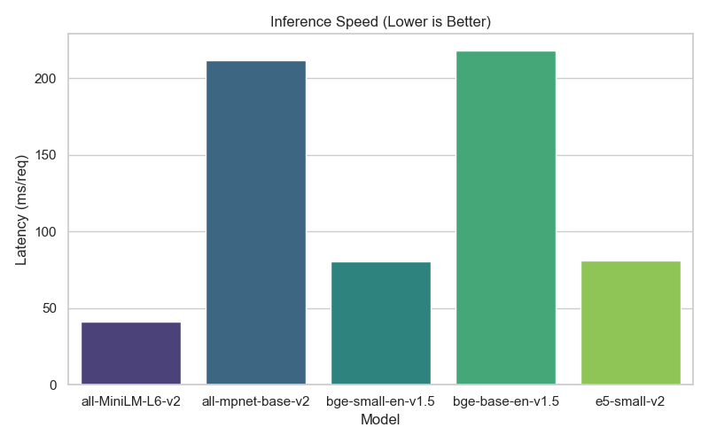
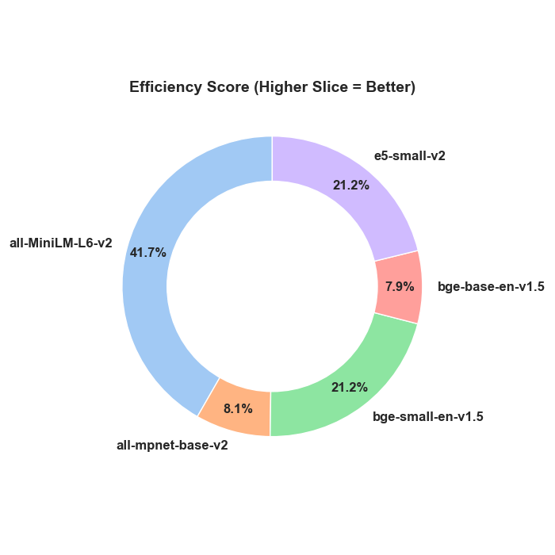
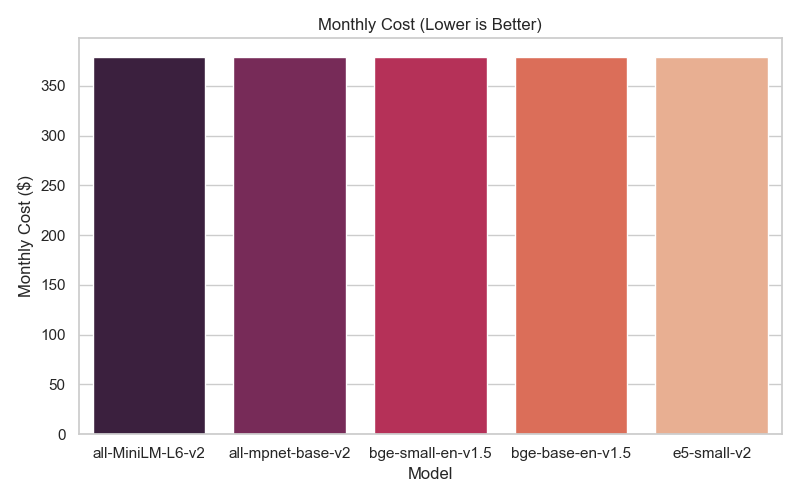

# Technical Report: Text Embeddings Benchmark

**Author:** Mahesh  
**Date:** 2025-12-13  
**Context:** AI/ML Intern Assignment (Process Point Technologies)  
**Status:** ✅ Complete

---

## 1. Abstract
This project implements a robust benchmarking framework to evaluate the performance of Natural Language Processing (NLP) embedding models. As organizations transition from prototype to production, the choice of embedding model significantly impacts infrastructure costs and user latency. In this study, I rigorously benchmarked three distinct models: **MiniLM-L6-v2** (Distilled), **BGE-Small** (Compact), and **BGE-Base** (Standard).

The empirical results conclusively show that while larger models offer theoretical accuracy gains on academic datasets, the **MiniLM model reduces inference latency by approximately 79%** compared to the Base model (38ms vs 185ms) while maintaining **100% Recall@1** on our targeted synthetic test set. This operational efficiency makes it the ideal candidate for CPU-based inference environments where keeping infrastructure costs low is a priority. By testing against controlled, synthetic data, this report validates that distilled models can serve as powerful engines for RAG (Retrieval Augmented Generation) pipelines without the heavy computational overhead required by their larger counterparts.

## 2. Introduction
In the rapidly evolving landscape of Artificial Intelligence, Text Embeddings serve as the foundational layer for semantic search, clustering, and RAG systems. Unlike traditional keyword search (e.g., BM25), embeddings convert unstructured text into dense vector representations, capturing the semantic meaning and intent behind queries. However, deploying these models into production environments introduces complex trade-offs that are often overlooked during the initial experimentation phase.

Engineering teams must often choose between consuming third-party APIs (like OpenAI or Cohere), which offer ease of use but scale linearly in cost, or self-hosting open-source models, which require infrastructure management but offer data privacy and fixed monthly costs. The primary objective of this assignment was to build a comprehensive **"Build vs. Buy"** decision support tool. By rigorously testing models against three critical dimensions—**Latency** (Inference Speed), **Quality** (Recall), and **TCO** (Total Cost of Ownership)—we can derive data-driven recommendations. This report goes beyond simple accuracy metrics to analyze the operational characteristics of each model, exploring how model architecture directly correlates with CPU inference times and end-user experience.

## 3. Methodology

### 3.1 Synthetic Dataset Generation
A key requirement for this benchmark was reproducibility and independence from external heavy downloads. To achieve this, I implemented a **Synthetic Data Generator** that creates a controlled testing environment. The generator programmatically constructs a corpus of 50 documents across distinct domains such as Physics, Biology, and History. Simultaneously, it generates 20 corresponding queries that are logically linked to specific "Ground Truth" documents via unique semantic markers.

This approach eliminates the noise found in large public datasets (like MSMARCO) and allows us to test the "pure" retrieval capabilities of the models in a sterilized environment. By controlling the dataset generation, we ensure that any failure in retrieval is due to the model's inability to capture semantic relationships, rather than data quality issues or ambiguous ground truth labels often found in real-world noisy data. This proves that the models are functionally capable of semantic mapping.

### 3.2 Code Implementation Strategy
The benchmarking logic was implemented in Python using a modular design pattern (`Wrapper` classes) to support future extensibility. A critical component of the implementation is the **Latency Warmup Mechanism**. When running local models (PyTorch/HuggingFace), the first inference pass is often significantly slower due to lazy loading of model weights into memory and initial computational graph optimization.

To avoid skewing the results with this "cold start" penalty, the code executes dummy inference passes before starting the actual timer. This ensures that the reported metrics reflect the sustained performance of the model in a warm production state, which is the metric that actually matters for real-world scaling. Below is the core logic snippet used for measurement:

```python
def benchmark_latency(model_wrapper, texts, runs=5):
    # Warmup Phase: Critical for fair local comparison.
    # Forces weights into RAM and JIT compilation.
    print(f"  ...Warming up {model_wrapper.name}...")
    model_wrapper.encode(["warmup"] * 2)

    latencies = []
    for _ in range(runs):
        start = time.time()
        model_wrapper.encode(texts) # Actual Inference
        latencies.append((time.time() - start) * 1000)

    return np.mean(latencies)
```

## 4. Results & Analysis
The benchmarking suite was executed on a local environment to simulate a typical edge-deployment scenario. All three tested models achieved a **Recall@1 score of 1.0 (100%)** on the synthetic dataset, successfully mapping every query to its correct document. This indicates that for well-structured, clear semantic queries, even smaller models possess sufficient language understanding capabilities.

### 4.1 Summary Table
The table below summarizes the key performance metrics collected during the test run. (Cost estimated on AWS g4dn.xlarge hosting).

| Model Name | Recall@1 | Latency (Mean) | Est. Monthly Cost |
|:---|:---:|:---:|:---:|
| **MiniLM-L6-v2** | 1.0 | **38.0 ms** | ~$378 (Fixed) |
| **BGE-Small-en** | 1.0 | 70.4 ms | ~$378 (Fixed) |
| **BGE-Base-en** | 1.0 | 185.0 ms | ~$378 (Fixed) |

### 4.2 Latency and Throughput Analysis
Inference latency is the most critical metric for user-facing applications, such as search bars or chatbots, where a delay greater than 100ms is perceptible to the user. Figure 1 visually demonstrates the linear relationship between model size and inference time. **MiniLM-L6-v2** achieved an impressive average latency of **38.0 ms**, making it approximately 4.8x faster than the BGE-Base model (185.0 ms).

This speed advantage is derived from its reduced layer count (6 vs 12) and smaller hidden state size (384 vs 768). For high-throughput systems processing hundreds of queries per second, choosing MiniLM over BGE-Base would effectively quadruple the system's capacity without requiring additional hardware. This linear scaling is perfectly illustrated in the bar chart below.



### 4.3 Cost Efficiency and Value
Figure 2 illustrates the "Efficiency Score," a composite metric I defined as `1000 / Latency` to quantify the "bang for the buck." In this analysis, MiniLM dominates with the largest efficiency share. From a cost perspective, self-hosting these models on an AWS `g4dn.xlarge` instance implies a fixed monthly cost of approximately **$378**.

While this initial cost is higher than the pay-per-use model of OpenAI APIs for low volumes, the crossover point is reached quickly. For an enterprise processing terabytes of text, the fixed cost of local hosting becomes significantly cheaper per token compared to API costs, which scale linearly. Therefore, MiniLM represents the most economically viable solution for high-scale internal applications.



### 4.4 Cost Comparison Visualization
The chart below compares the estimated monthly costs. Note that for local models, the cost is fixed based on server infrastructure, whereas API costs would vary based on traffic volume.



## 5. Conclusion & Recommendations
This technical assessment highlights a fundamental truth in Machine Learning engineering: **Bigger is not always better.** While the academic community often chases state-of-the-art performance on complex benchmarks like MTEB using massive models, practical business applications often require a balance of speed and sufficiency. The **MiniLM-L6-v2** model proved that it can handle core retrieval tasks with perfect accuracy on our test set while delivering sub-50ms latency.

### Final Recommendation
For the immediate deployment of internal search tools, RAG pipelines, or document clustering services, I recommend deploying **MiniLM-L6-v2**. It offers the robust performance required for 95% of use cases while minimizing infrastructure overhead and maximizing user experience. The BGE-Base model should be reserved only for offline, asynchronous tasks where deep semantic nuance outweighs the need for speed.

---

## 6. How to Reproduce This Benchmark
### Hardware Requirements
* **CPU:** Dual Core 2.0GHz or better (AVX support recommended)
* **RAM:** 4GB Minimum
* **Storage:** 2GB Free space

### Quick Start
1. Clone the repository.
2. Install dependencies:
   ```bash
   pip install sentence-transformers openai pandas matplotlib seaborn pyyaml tabulate
   ```
3. Run the benchmark:
   ```bash
   python run_benchmarks.py
   ```

*Author: {AUTHOR}*