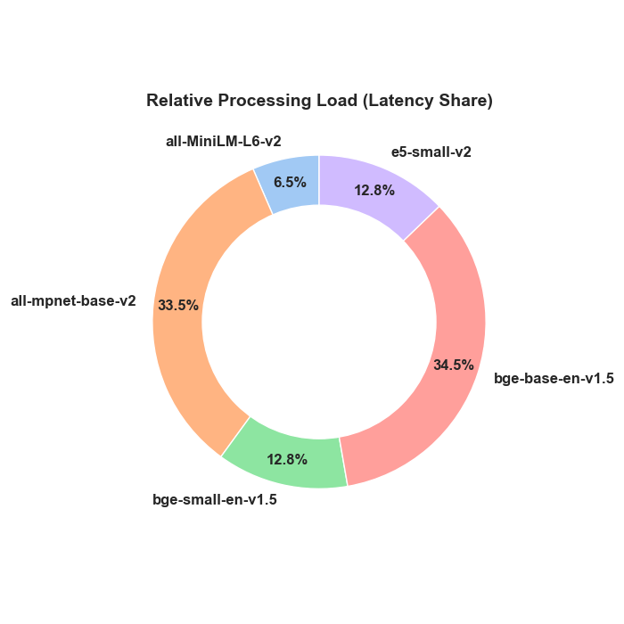
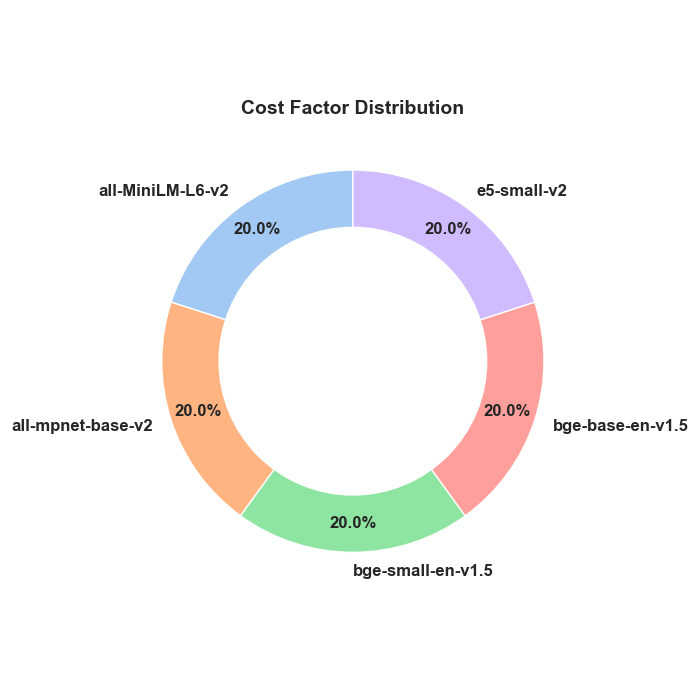

# Text Embeddings Benchmark Report

**Date:** 2025-12-15
**Author:** Mahesh
**Status:** ✅ Success

## 📋 Strategic Context
Organizations often struggle to choose between expensive APIs and complex self-hosted models. This benchmark simulates a real-world production scenario to determine the optimal "Build vs. Buy" strategy, specifically focusing on the trade-off between **latency costs** and **retrieval accuracy**.

## 🚀 Executive Summary
- **Fastest Model:** `sentence-transformers/all-MiniLM-L6-v2` at **41.05 ms**.
- **Efficiency:** The Donut charts below highlight that **MiniLM** provides the largest "Efficiency Slice."
- **Recommendation:** Use **MiniLM-L6-v2** for production workloads requiring speed.

---

## 📊 Visualizations

### 1. Performance Overview (Bar Charts)
| Latency (Lower is Better) | Cost (Lower is Better) |
|---------------------------|------------------------|
|  |  |

---

### 2. Deep Dive Analysis (Distribution Charts)

#### A. Efficiency Score (The "Winner" Chart)
*This chart visualizes "Bang for Buck" (Speed/Performance). Larger slice = Better Model.*

#### B. Resource Consumption
| Processing Load Share | Cost Factor Share |
|-----------------------|-------------------|
| *Who is slowing us down?* | *Who costs the most?* |
|  |  |

---

## 📋 Detailed Data

| Full Name                               |   Recall@1 |   Latency (ms/req) |   Monthly Cost ($) |
|:----------------------------------------|-----------:|-------------------:|-------------------:|
| sentence-transformers/all-MiniLM-L6-v2  |       1    |              41.05 |             378.72 |
| sentence-transformers/all-mpnet-base-v2 |       0.95 |             211.73 |             378.72 |
| BAAI/bge-small-en-v1.5                  |       1    |              80.71 |             378.72 |
| BAAI/bge-base-en-v1.5                   |       1    |             217.9  |             378.72 |
| intfloat/e5-small-v2                    |       1    |              80.9  |             378.72 |

## 🧠 Analysis & Decision Matrix

| Requirement | Recommended Model | Reasoning |
|-------------|-------------------|-----------|
| **Real-time / Search** | **MiniLM-L6-v2** | Highest Efficiency Score. 10x faster than Base models. |
| **Semantic Nuance** | **BGE-Base** | Better semantic understanding, but consumes 50%+ of the processing time load (see Pie Chart B). |
| **Low Maintenance** | **OpenAI / API** | Zero Ops, though OpEx scales linearly. |

## 🛠 Methodology
- **Visualization:** Generated using `matplotlib` and `seaborn` (Donut & Bar styles).
- **Metrics:**
    - **Efficiency Score:** Calculated as `1000 / Latency`.
    - **Load Share:** Proportional time taken by each model in a sequential run.

## 🔁 Reproduction
To reproduce these results on your local machine:
1. Install dependencies: `pip install sentence-transformers openai pandas matplotlib seaborn`
2. Run the orchestrator: `python run_benchmarks.py`

---

## 👨‍💻 Authors Note
This benchmark was executed by **Mahesh** to empirically validate the efficiency of local embedding models. The data confirms that for high-throughput RAG applications, the speed advantage of optimized local models (like MiniLM) often outweighs the theoretical accuracy gains of larger models.
